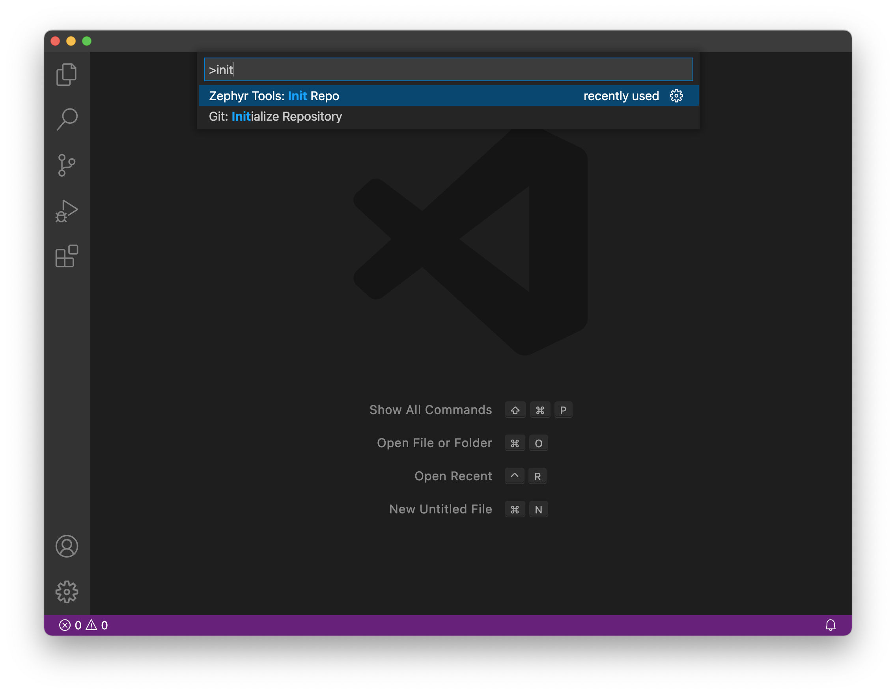
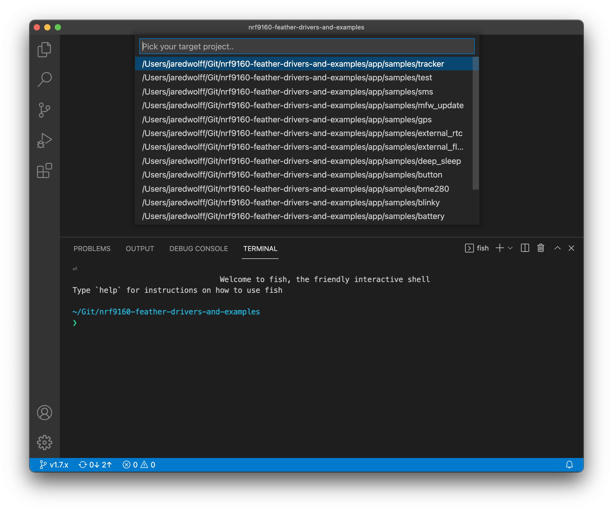
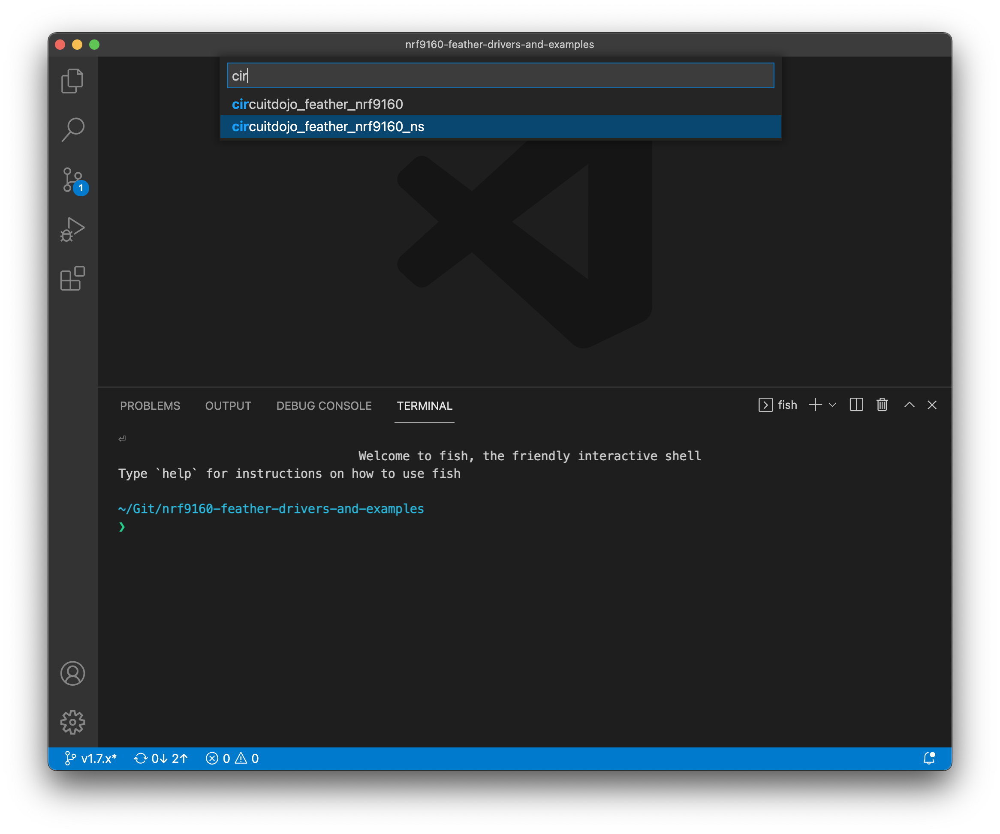
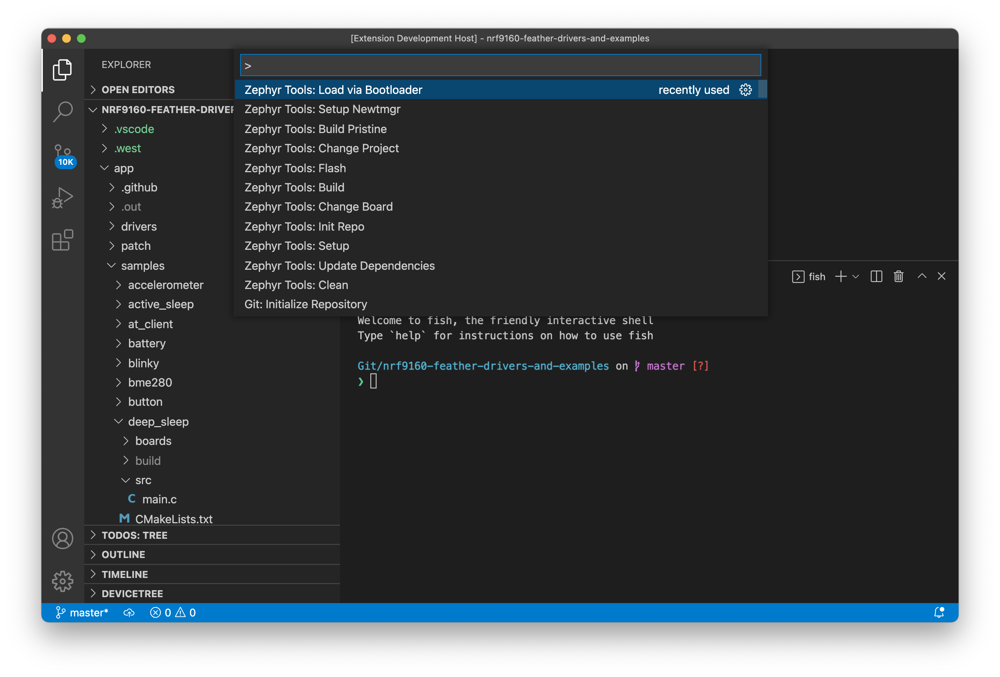
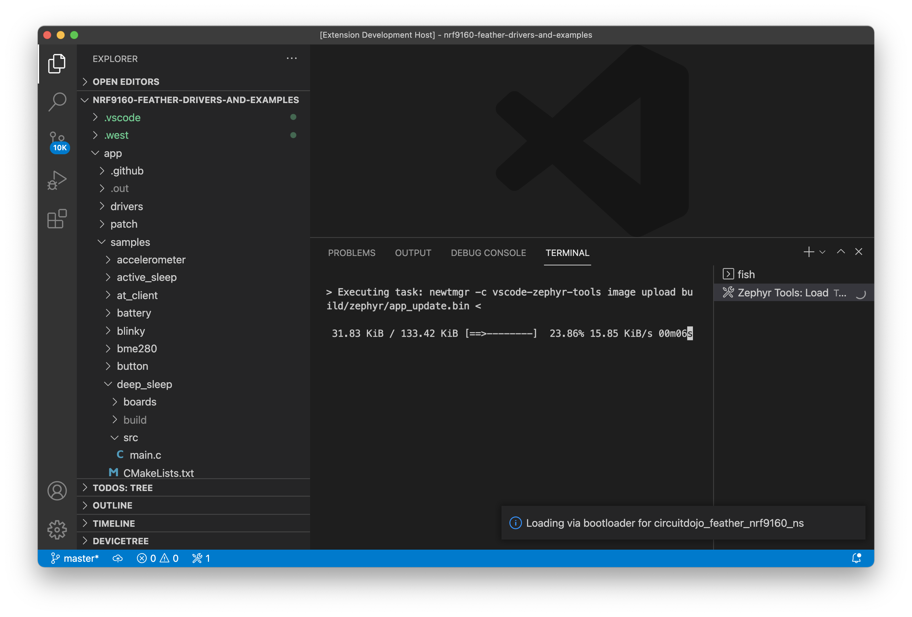
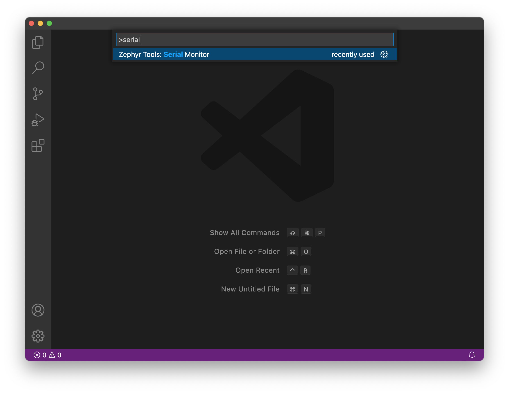
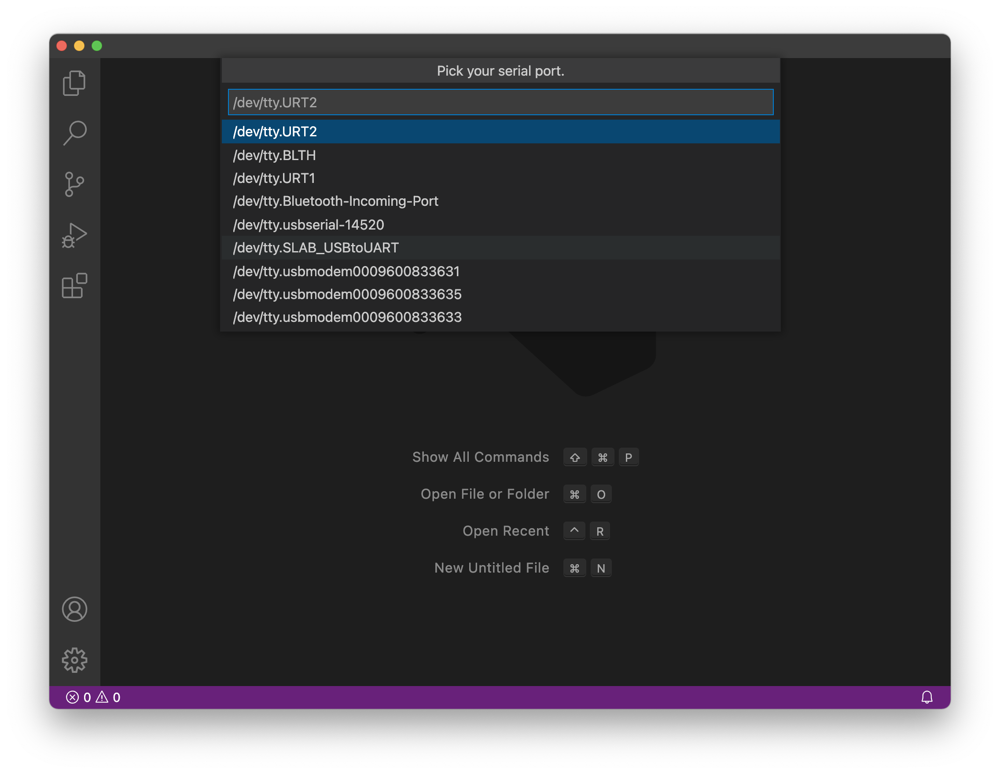

# nRF9160 Feather Examples and Drivers

Zephyr examples and drivers for the nRF9160 Feather.

## Setup

1. Before you get started, you'll need to install the nRF Connect SDK. Here are the full instructions:

   * [Mac](https://docs.jaredwolff.com/nrf9160-sdk-setup-mac.html)
   * [Windows](https://docs.jaredwolff.com/nrf9160-sdk-setup-windows.html)
   * [Linux](https://docs.jaredwolff.com/nrf9160-sdk-setup-linux.html)

2. Initialize your repository using this Git url: `https://github.com/circuitdojo/nrf9160-feather-examples-and-drivers.git` and the **Zephyr Tools: Init Repo** command

	

    **Note:** It is recommended to check out the default branch (simply press enter)

	**Note:** It's best to select an empty folder to initialize the project to.

## Building and flashing the code

Using the command window run **Zephyr Tools: Build**

If prompted select the project `nfed/samples/<sample name>` and type `circuitojo_feather_nrf9160_ns` as the target.

Then place the device into bootloader mode:
   1. Hold the MODE button
   2. Then tap the RST button while holding mode
   3. **Hold the MODE button until the Blue LED illuminates**

Then, load using the **Zephyr Tools: Load via Bootloader** task.

Pay attention to the progress in the bottom console.

Once complete, the extension will reset your device and should start executing!

## Viewing console output

You can then view the output using the **Zephyr Tools: Serial Monitor** command. You can also run **Zephyr Tools: Load via Booloader and Monitor** to both at the same time.

Make sure you select the port that corresponds to your device. On Mac the serial port will be `/dev/tty.SLAB_USBtoUART`

## License

Apache 2.0 applies to all samples except for the **tracker** sample. See [samples/tracker/LICENSE](samples/tracker/LICENSE) for more info. Some samples are based off of the nRF Connect SDK or Zephyr SDK. Full credit goes to those authors. See license information at the top of those files fore details.