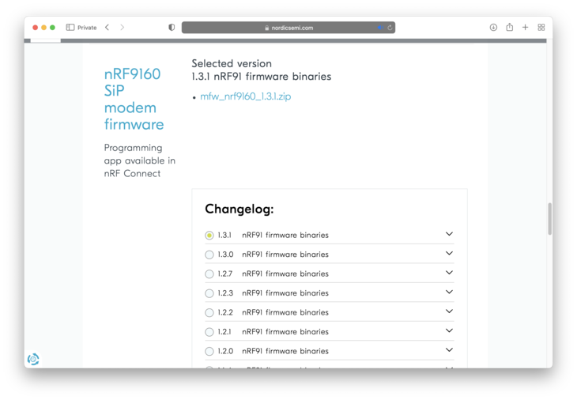
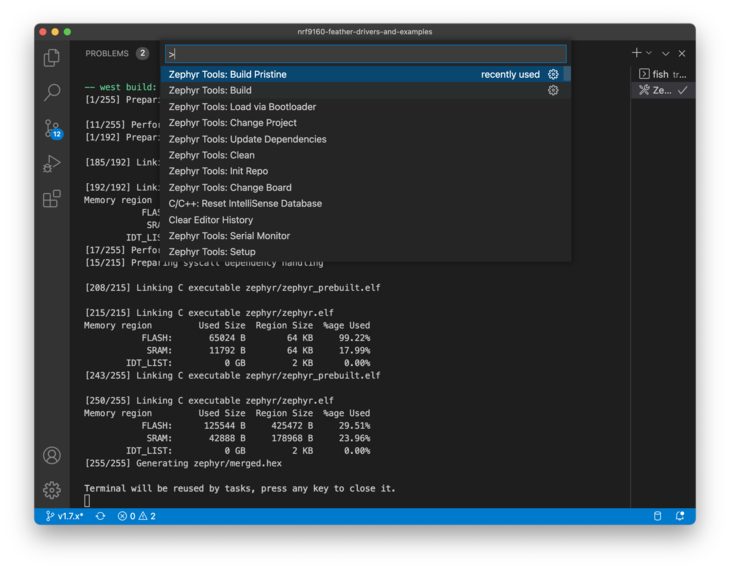
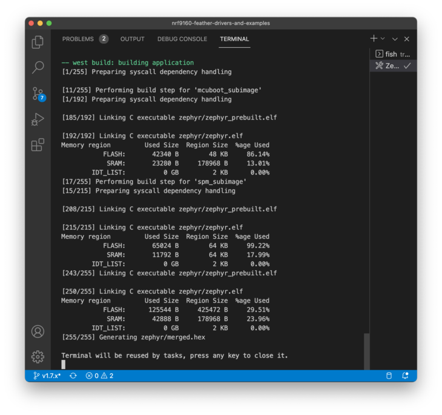
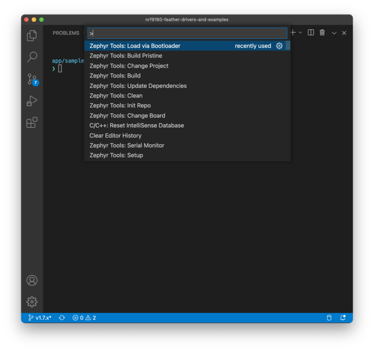
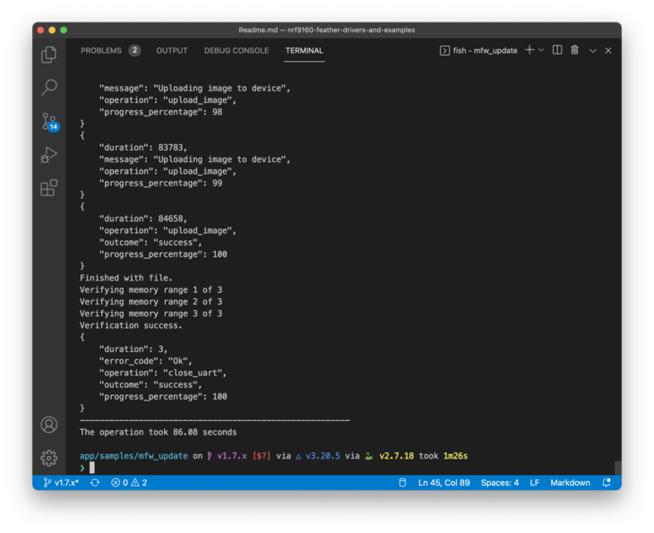

# Modem Firmware Update 

This sample can be used to load new modem firmware to your device using the *bootloader only*. This is useful if you do not have a programmer!

## Setup

Make sure you have the VSCode plugin installed and running. Here are the instructions for each major architecture:

* [Windows](https://docs.jaredwolff.com/nrf9160-sdk-setup-windows.html#installing-sdk)
* [Mac](https://docs.jaredwolff.com/nrf9160-sdk-setup-mac.html#installing-sdk)
* [Linux](https://docs.jaredwolff.com/nrf9160-sdk-setup-linux.html#installing-sdk)

## Get the modem firmware

Get your modem firmware of choice by nagivating to the [nRF9160 Download page](https://www.nordicsemi.com/Products/Development-hardware/nRF9160-DK/Download) and scrolling to the **nRF9160 SiP modem firmware** section:



Download the version you'd like to use. 

**IMPORTANT:** currently nRF9160 Feather is shipped with version 1.2.3 of the modem firmware. If you upgrade > v1.3.0 **you cannot downgrade** according to Nordic.

## Build

Build the sample targeting `circuitdojo_feather_nrf9160_ns`.




## Loading

Then load to your device:




## Running Python script

With `python` installed you should be able to run the corresponding `update_modem.py` script easily:

```
python3 update_modem.py mfw_nrf9160_1.3.0.zip /dev/tty.SLAB_USBtoUART 1000000
```

**Note:** `update_modem.py` is located in NFED under the `app/samples/mfw_update/` path.

Here's what it should look like at the end of the process.



## Confirming

You can confirm you have the version you loaded by running the `AT+CGMR` AT Command using `at_client`:

```
The AT host sample started
> AT+CGMR
mfw_nrf9160_1.3.0
OK
```

