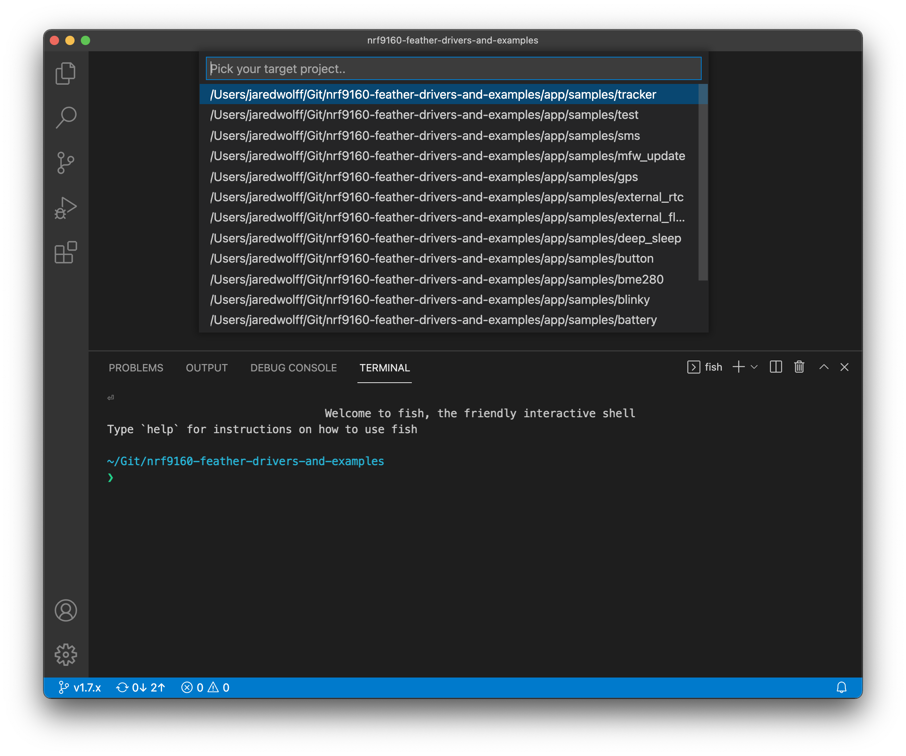
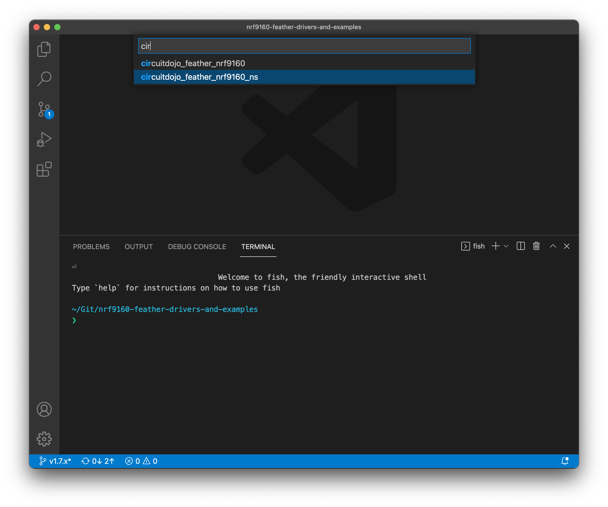
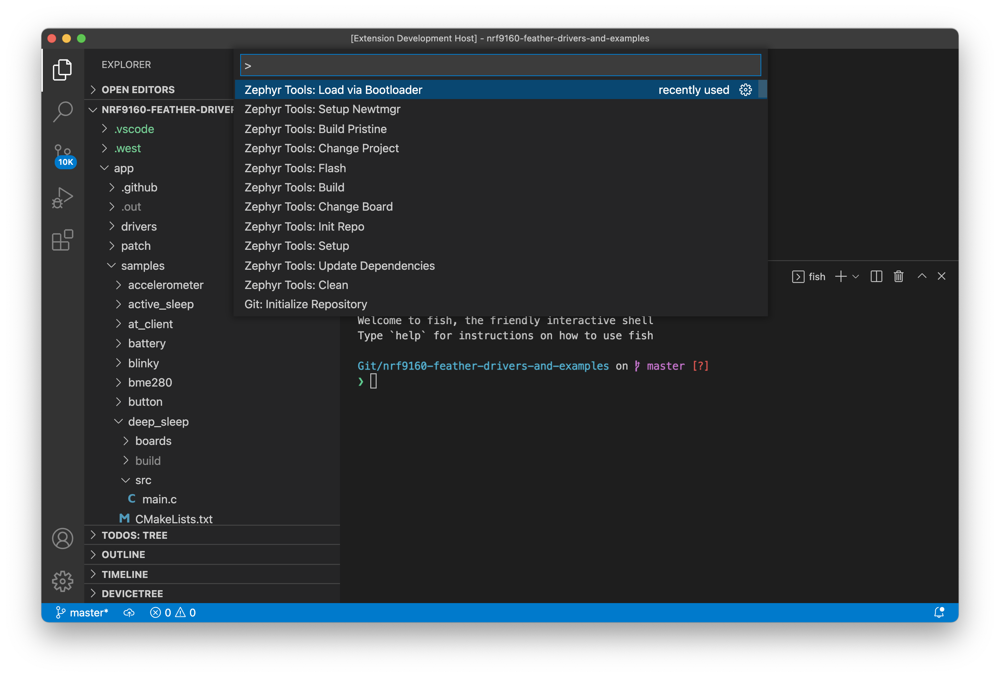
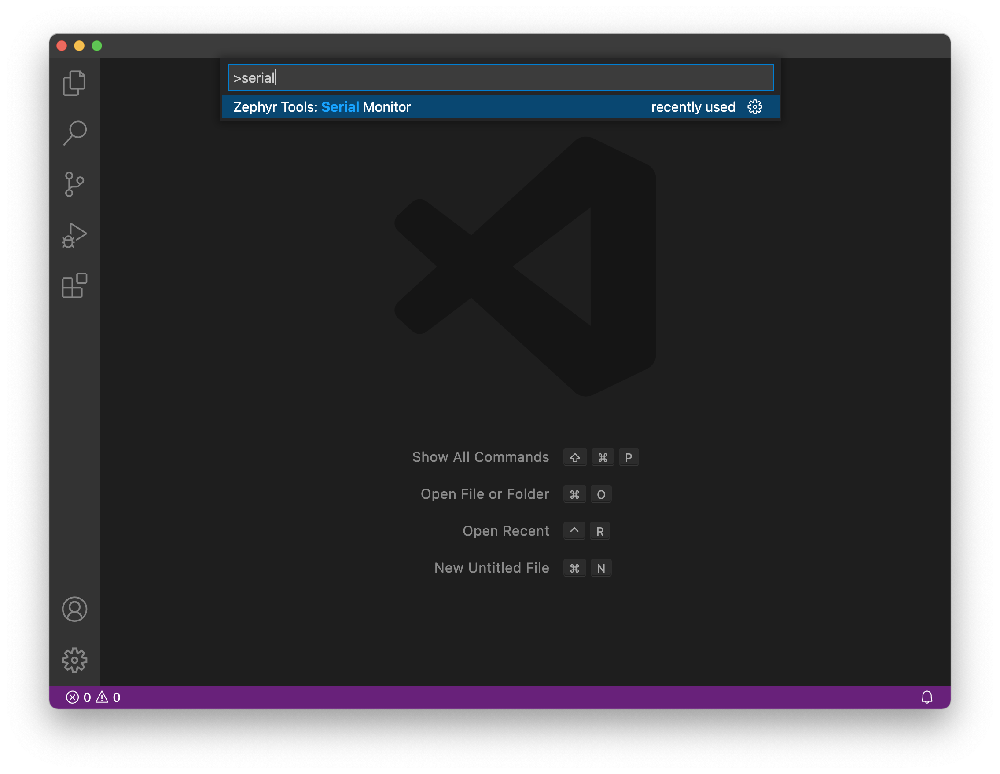

# nRF9160 Feather - Tracker Demo

In this sample, the nRF9160 Feather collects some GPS data and pushes to your cloud interface of choice. Cloud backends incude:

* Golioth
* Pyrinas

This example is also configurable via the Golioth console or via `goliothctl` (Golioths CLI). For more information check out the [blog post here.](https://www.jaredwolff.com/nrf9160-feather-on-golioth/)

## Setup

1. Install the VSCode Extension and SDK.

   Here are the links for each operating system:

   - [Mac OS](https://docs.jaredwolff.com/nrf9160-sdk-setup-mac.html)
   - [Windows](https://docs.jaredwolff.com/nrf9160-sdk-setup-windows.html)
   - [Linux](https://docs.jaredwolff.com/nrf9160-sdk-setup-linux.html)

2. Initialize your repository using this Git url: `git@github.com:circuitdojo/golioth-demo.git` and the **Zephyr Tools: Init Repo** command

	

	**Note:** It's best to select an empty folder to initialize the project to.

2. Sign up to download Nordic's SUPL library [here](https://response.nordicsemi.com/suplc-license-signup). Then, install using the instructions provided with the download package. (Files downloaded should be placed in the  `nrf/ext` folder.)

## Building and flashing the code

Using the command window run **Zephyr Tools: Build**


If prompted select the project `path/to/your/project/nfed/samples/tracker` and type `circuitojo_feather_nrf9160_ns` as the target.





Then place the device into bootloader mode:
   1. Hold the MODE button
   2. Then tap the RST button while holding mode
   3. **Hold the MODE button until the Blue LED illuminates**

Then, load using the **Zephyr Tools: Load via Bootloader** task.



Pay attention to the progress in the bottom console.


Once complete, the extension will reset your device and should start executing!

## Update credentials in modem (one time only)

Open a terminal or [LTE Link Monitor](https://infocenter.nordicsemi.com/index.jsp?topic=%2Fug_link_monitor%2FUG%2Flink_monitor%2Flm_intro.html) you can execute the following commands one at a time:

```
AT+CFUN=4
AT%CMNG=0,1,4,"<DEVICE IMEI>"
AT%CMNG=0,1,3,"<HEX STRING PSK>"
AT+CFUN=0
```

**Important note:** your PSK must be in hex string format. You can use a site [like this one](https://www.rapidtables.com/convert/number/ascii-to-hex.html) to convert it first.

Example:

```
AT+CFUN=4
AT%CMNG=0,1,4,"device-id@air-quality-wing"
AT%CMNG=0,1,3,"376230346333762303463337623034633376230346333762303463337623034633"
AT+CFUN=1
```

Make sure you enter the device IMEI and hex string PSK *exactly* otherwise your device will fail to authenticate with Golioth!

## Viewing console output

You can then view the output using the **Zephyr Tools: Serial Monitor** command. You can also run **Zephyr Tools: Load via Booloader and Monitor** to both at the same time.



Make sure you select the port that corresponds to your device. On Mac the serial port will be `/dev/tty.SLAB_USBtoUART`


